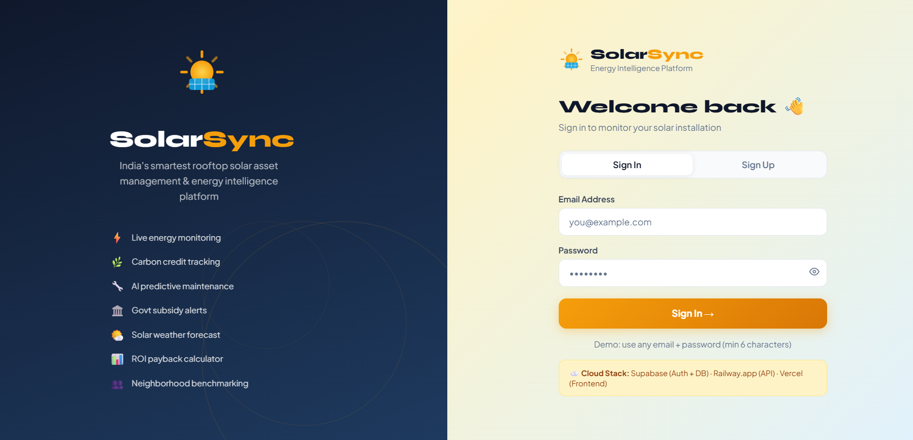
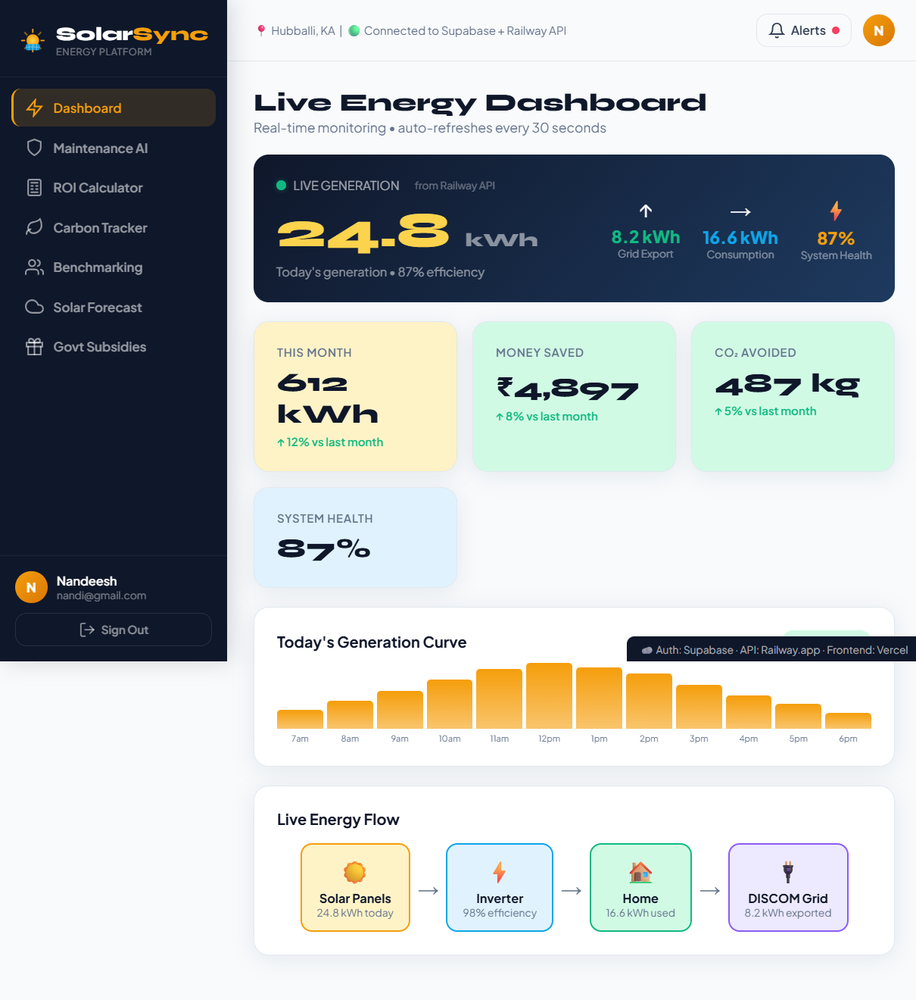
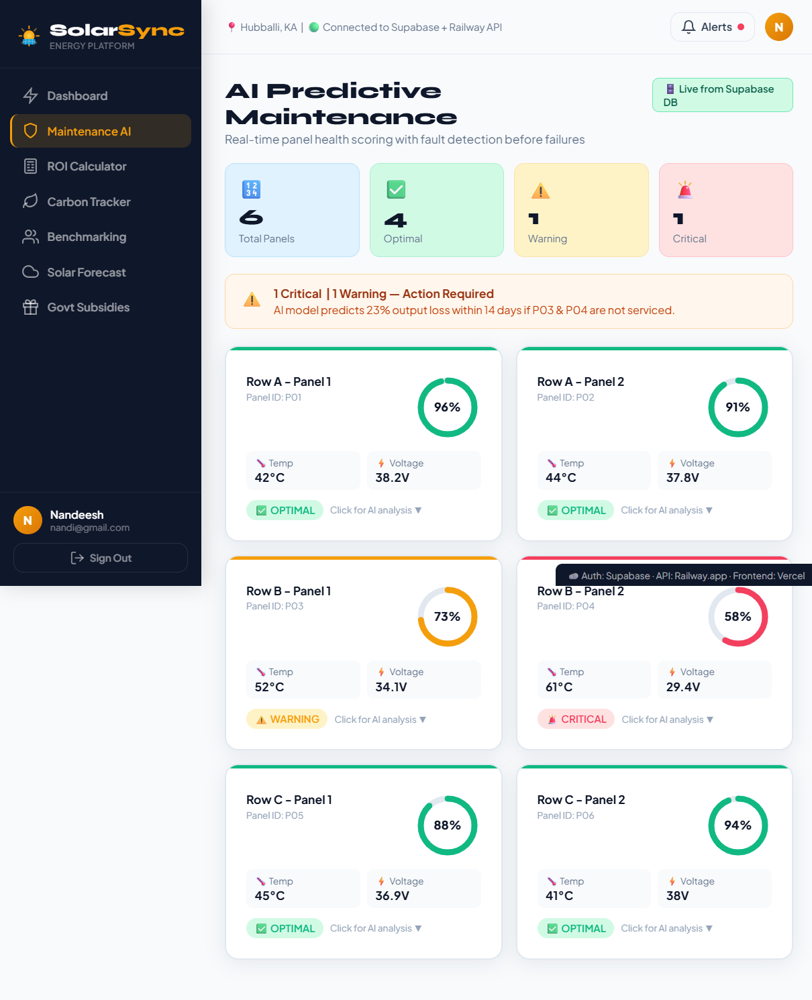
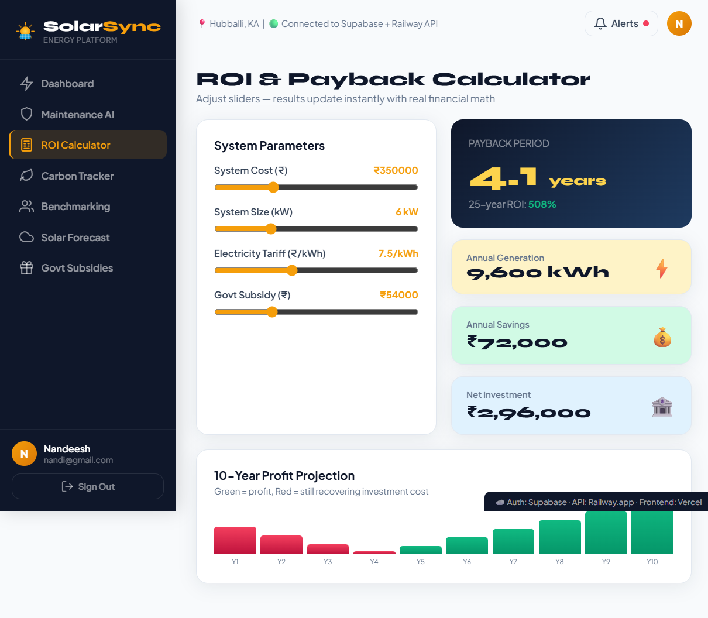
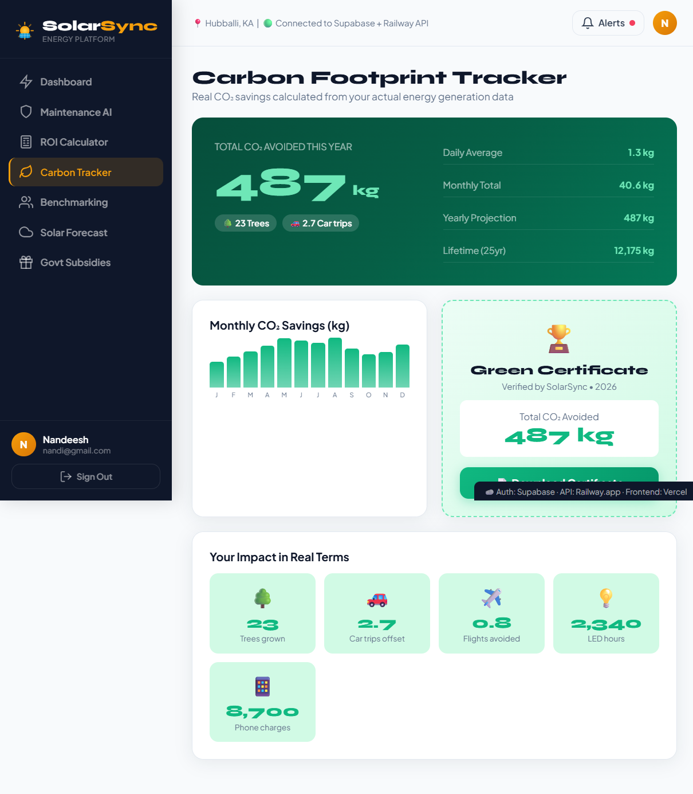
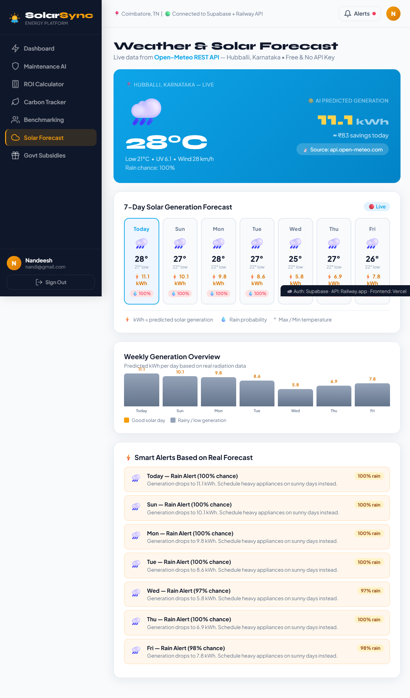
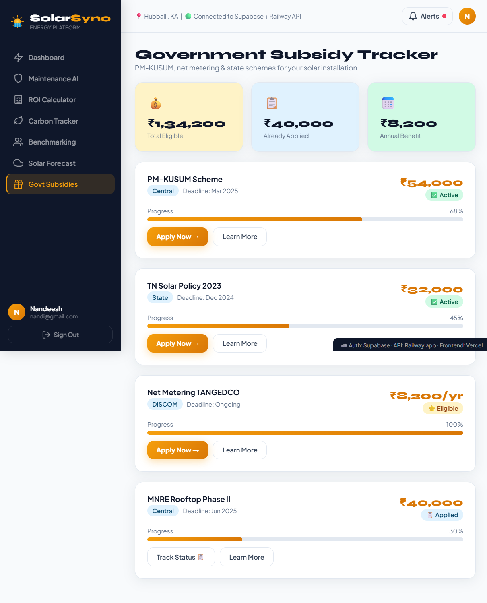

<div align="center">

# ☀️ SolarSync
### SQL-Backed Automated Data Platform & ETL Pipeline
**Rooftop Solar Asset Management & Energy Intelligence Platform**

[](https://solarsync-pied.vercel.app/)
[](https://solarsync-backend.onrender.com)
[](https://supabase.com)
[](./etl/)

</div>

---

## 📌 Project Description

SolarSync is a **cloud-native SaaS platform** engineered as a full-stack automated data pipeline for rooftop solar asset management. It demonstrates a complete **Extract → Transform → Load (ETL)** architecture integrating live REST APIs into a 3NF-normalised SQL database, powering real-time operational dashboards.

---

##  System Architecture

```
┌─────────────────────────────────────────────────────────────────┐
│                        USER BROWSER                             │
│              React SPA  @  Vercel CDN  (HTTPS)                  │
└──────────────────────────┬──────────────────────────────────────┘
                           │ REST API calls (JWT auth)
┌──────────────────────────▼──────────────────────────────────────┐
│                   RENDER.COM BACKEND                            │
│                  Node.js + Express API                          │
│         IoT Simulator Cron │ Weather Proxy │ Auth Middleware    │
└──────┬───────────────────────────────────────────┬──────────────┘
       │                                           │
┌──────▼──────┐                        ┌───────────▼──────────────┐
│  SUPABASE   │                        │   PYTHON ETL PIPELINE    │
│ PostgreSQL  │◄───── ETL LOADS ───────│   etl/etl_pipeline.py    │
│  + pgBouncer│                        │   Runs every hour        │
│  + Auth JWT │                        └───────────┬──────────────┘
│  + RLS RBAC │                                    │
└─────────────┘                        ┌───────────▼──────────────┐
                                       │   OPEN-METEO REST API    │
                                       │  Free Weather + Radiation│
                                       │  7-day forecast JSON     │
                                       └──────────────────────────┘
```

---

##  ETL Pipeline Architecture

```
EXTRACT               TRANSFORM              LOAD
────────              ─────────              ─────
Open-Meteo     →    JSON → 3NF Schema   →   Supabase
REST API            Atomic attributes       PostgreSQL
(Weather +          No transitive deps      pgBouncer
Radiation)          Solar kWh formula       Batch upsert
                    Icon classification     Idempotent
```

### ETL Steps Explained

**Step 1 — EXTRACT**
Calls Open-Meteo REST API with parameters for temperature, UV index, radiation (MJ/m²), wind speed, and precipitation probability for 7 days.

**Step 2 — TRANSFORM**
Converts unstructured JSON payload into atomic 3NF schema rows:
- Derives `predicted_kwh` using solar physics formula: `kWh = Radiation × Area × Efficiency × Rain_Factor / 3.6`
- Classifies weather icons deterministically from rain probability + UV thresholds
- Separates raw weather attributes from derived solar metrics

**Step 3 — LOAD**
Batch upserts transformed rows into Supabase PostgreSQL in chunks of 100 for throughput optimization. Uses `ON CONFLICT DO UPDATE` for idempotent pipeline reruns.

---

##  Database Schema (3NF Normalised)

| Table | Primary Key | Description |
|-------|------------|-------------|
| `user_profiles` | `user_id` (FK → auth.users) | User + solar system config |
| `energy_readings` | `id` UUID | IoT telemetry — hourly kWh readings |
| `weather_forecasts` | `forecast_date` | ETL-loaded Open-Meteo data |
| `energy_stats` | `user_id` | Aggregated summary metrics |
| `panels` | `id` UUID | Solar panel health registry |
| `maintenance_logs` | `id` UUID | AI maintenance records |

**3NF Compliance:**
-  All attributes depend only on the primary key (no partial dependencies)
-  No transitive dependencies between non-key attributes
-  Foreign keys maintain referential integrity
-  `weather_forecasts` uses `forecast_date` as natural key for idempotent ETL

**Analytical Views:**
- `daily_generation_summary` — aggregates hourly readings per user per day
- `monthly_generation_summary` — monthly kWh + savings + CO₂ metrics

---

##  Security — RBAC Implementation

```sql
-- Row Level Security (RLS) enforced on all 6 tables
-- Users can ONLY read/write their own rows
ALTER TABLE energy_readings ENABLE ROW LEVEL SECURITY;
CREATE POLICY "user_only" ON energy_readings
  FOR ALL USING (auth.uid() = user_id);

-- ETL pipeline uses service_role key → bypasses RLS for bulk writes
-- Frontend uses anon key → subject to RLS policies
```

**Roles used:**
- `anon` — unauthenticated public access (blocked by RLS)
- `authenticated` — logged-in users (access own rows only)
- `service_role` — ETL pipeline writes (bypasses RLS, server-side only)

---

##  Connection Pooling

Supabase provides built-in **pgBouncer** connection pooler:

```
Direct connection  → port 5432  (development only)
Pooled connection  → port 6543  (production — ETL + API)
Pool mode          → Transaction (optimal for stateless REST workloads)
Max connections    → 60 (free tier pgBouncer)
```

The ETL pipeline and backend API both connect through the pooler automatically via Supabase REST API, ensuring high throughput under concurrent load.

---

##  Features

| # | Feature | Tech Used |
|---|---------|-----------|
| 1 |  Live Energy Dashboard | Supabase real-time, Node.js API |
| 2 |  AI Predictive Maintenance | Panel health scoring, DB queries |
| 3 |  ROI & Payback Calculator | Frontend math engine |
| 4 |  Carbon Footprint Tracker | ETL-derived CO₂ metrics |
| 5 |  Neighborhood Benchmarking | Aggregated SQL views |
| 6 |  Weather Solar Forecast | Open-Meteo API + ETL pipeline |
| 7 |  Govt Subsidy Tracker | Static + dynamic data layer |

---

##  Screenshots

###  Login & Signup


###  Live Energy Dashboard


###  AI Maintenance Panel


###  ROI Calculator


###  Carbon Tracker


###  Weather Forecast


###  Subsidy Tracker


---

##  Tech Stack

### Frontend
| Tool | Purpose |
|------|---------|
| React 18 + Vite | SPA framework + build tool |
| @supabase/supabase-js | Auth SDK + real-time client |
| Vanilla CSS | Custom design system |

### Backend
| Tool | Purpose |
|------|---------|
| Node.js 20 + Express | REST API server |
| @supabase/supabase-js | Database client |
| node-cron | IoT data simulation scheduler |

### ETL Pipeline
| Tool | Purpose |
|------|---------|
| Python 3.11 | ETL orchestration language |
| requests | HTTP client for Open-Meteo API |
| python-dotenv | Secrets management |
| schedule | Hourly pipeline scheduling |

### Database & Infrastructure
| Tool | Purpose |
|------|---------|
| Supabase PostgreSQL | Primary 3NF database |
| Supabase Auth | JWT authentication |
| Supabase RLS | Row-level access control |
| Supabase pgBouncer | Connection pooling (port 6543) |
| Open-Meteo API | Free weather REST API |

### Deployment (100% Free)
| Layer | Platform | URL |
|-------|----------|-----|
| Frontend | Vercel | https://solarsync-pied.vercel.app/ |
| Backend API | Render.com | https://solarsync-backend.onrender.com |
| Database | Supabase | https://supabase.com |
| ETL Pipeline | Render.com (Background Worker) | Same backend instance |

---

##  Repository Structure

```
solarsync/
├── frontend/                    # React + Vite SPA
│   ├── src/
│   │   ├── App.jsx              # Main app with all 7 features
│   │   └── main.jsx             # React entry point
│   ├── index.html
│   ├── vite.config.js
│   ├── package.json
│   └── .env.example             # VITE_SUPABASE_URL etc.
│
├── backend/                     # Node.js + Express API
│   ├── server.js                # REST API + IoT cron + ETL trigger
│   ├── package.json
│   └── .env.example             # SUPABASE_URL, PORT etc.
│
├── etl/                         # Python ETL Pipeline ★
│   ├── etl_pipeline.py          # Extract → Transform → Load
│   ├── scheduler.py             # Hourly cron runner
│   ├── requirements.txt         # Python dependencies
│   └── .env.example
│
├── scripts/
│   └── schema.sql               # 3NF schema + RBAC + Views
│
├── docs/
│   └── screenshots/             # App screenshots for README
│
└── README.md                    # This file
```

---

##  Setup & Installation

### Prerequisites
- Node.js 20+
- Python 3.11+
- Supabase account (free)
- Render.com account (free)
- Vercel account (free)

### Step 1 — Database Setup
```bash
# Go to Supabase Dashboard → SQL Editor → New Query
# Paste contents of scripts/schema.sql → Run
```

### Step 2 — Backend Setup
```bash
cd backend
npm install
cp .env.example .env
# Fill in SUPABASE_URL and SUPABASE_SERVICE_KEY
npm run dev       # local development
```

### Step 3 — ETL Pipeline Setup
```bash
cd etl
pip install -r requirements.txt
cp .env.example .env
# Fill in SUPABASE_URL and SUPABASE_SERVICE_KEY
python etl_pipeline.py --lat 11.0168 --lon 76.9558
# Run scheduler (long-running process)
python scheduler.py
```

### Step 4 — Frontend Setup
```bash
cd frontend
npm install
cp .env.example .env
# Fill in VITE_SUPABASE_URL, VITE_SUPABASE_ANON_KEY, VITE_BACKEND_URL
npm run dev       # http://localhost:5173
```

### Step 5 — Deploy
```bash
# Backend + ETL → Render.com (free web service)
# Frontend → Vercel (connect GitHub repo, auto-deploy)
# Add environment variables in both Render and Vercel dashboards
```

---

##  Live Links

| Resource | URL |
|----------|-----|
|  Live Application | https://solarsync-pied.vercel.app/ |
|  Backend API | https://solarsync-backend.onrender.com |
|  API Health Check | https://solarsync-backend.onrender.com/ |
|  Open-Meteo (source) | https://api.open-meteo.com/v1/forecast |
|  Supabase Dashboard | https://supabase.com/dashboard |

---

##  Team

| Name | USN | Roll No |
|------|-----|---------|
| Sudeep S S | 01FE23BCI101 | 242 |
| Nandeesh IB | 01FE23BCI092 | 238 |
| N T Basavaraj | 01FE23BCI113 | 247 |

**Institution:** KLE Technological University  
**Department:** Computer Science & Engineering (AI)  
**Subject:** Cloud Computing  

---

##  License

MIT License — free to use for educational purposes.
